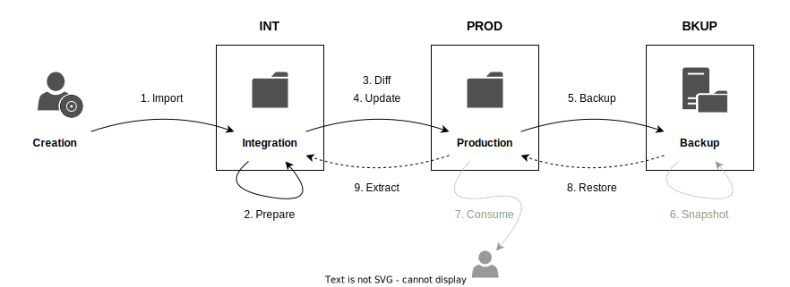
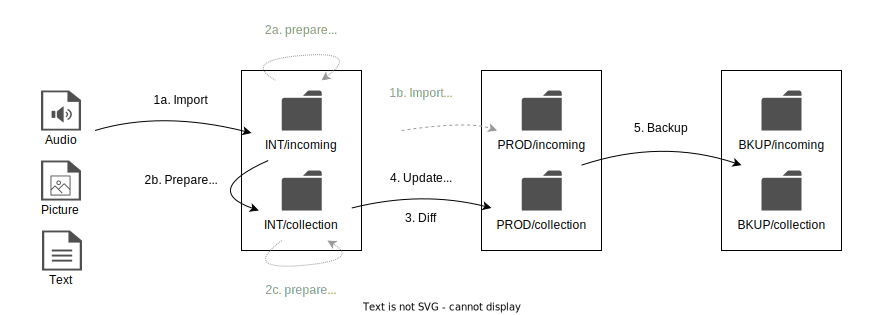

# media.holgernauen.de aka `mhd`

Tools to maintain the media collection.

> [!NOTE]
> All the stuff here is for my media collection and only tested on my devices and with my software.
> Feel free to ask, but I'm afraid I don't have the capacity for extensive support.

- [media.holgernauen.de aka `mhd`](#mediaholgernauende-aka-mhd)
  - [Workflow](#workflow)
  - [Installation](#installation)
    - [Required tools](#required-tools)
    - [Install `mhd`](#install-mhd)
  - [Usage](#usage)
    - [Configuration](#configuration)
      - [Config File `.mhdrc` or `.mhdrc.json5`](#config-file-mhdrc-or-mhdrcjson5)
      - [Environment Variables](#environment-variables)
      - [Order of Precedence](#order-of-precedence)
  - [Development](#development)
    - [Development in China](#development-in-china)

## Workflow

- Three stages are used to manage the media: INT, PROD and BKUP.
- **Integration** is used to prepare media and move the files into the collection.
  - This stage only contains data required for the current integration process, such as the media files (audio, video, images), associated documentation (texts, scans, other information) and linked documents (to validate the link).
  - The installation directory of the `mhd` project is used for the *integration* by default.
- **Production**
  - The *production* data is stored on an external hard disk.
- **Backup**
  - *Backups* are stored with the cloud service provider.



1. Import
   - Copy or move media files into the collection
   - `mhd import picture ...`
2. Prepare
   - Create uniform structure, enrich content
   - `mhd prepare album ...`
3. Diff
   - Check for differences between INT and PROD
   - Via [Rclone](https://rclone.org/)
   - `mhd exec diff`
4. Update
   - Add new data to production
   - Via [Rclone](https://rclone.org/)
   - `mhd exec update`
5. Backup
   - The entire collection is mirrored in the external system
   - Via [Rclone](https://rclone.org/)
   - `mhd exec backup`
6. Snapshot
   - Prevention of data loss, within the backup system
7. Consume
8. Restore
   - Via [Rclone](https://rclone.org/)
   - `mhd exec restore`
9. Extract
   - Via [Rclone](https://rclone.org/)
   - `mhd exec extract`



- Folder **incoming**
  - The **INT**/*incoming* folder contains fresh data that are immediately processed and enriched.
  - Media that need to be stored for a longer period of time without being integrated into the collection are stored and backed up via the **PROD**/*incoming* folder.
- Folder **collection**
  - The **collection** folder contains all the prepared media files.
  - **PROD**/*collection* is used, for example, to listen to the music.
- The *Prepare* process can only be partially automated.
  - 2a: The media in **INT**/*incoming* are manually tagged with the basic infos (album, artist, year, ...) and integrated into the folder structure, first.
  - 2b: Then, the data is transferred to the collection folder using `mhd prepare ...`, index files and folders and files for lyrics, scans, etc. are created automatically.
  - 2c: The content must then be enriched manually in **INT**/*collection*, e.g. lyrics are added and the texts of the booklet are copied into *index.md*. In this step, the tags of the music files are also finalized by adding lyrics and composer(s), for example.

## Installation

### Required tools

A few external tools are required for operation:

- [Rclone](https://rclone.org/) is used inrenally by `mhd` for file transfer between INT, PROD, and BKUP.
- The other tools are used by the shell scripts in `./tools/`.

```sh
brew install rclone
brew install exiftool
brew install ffmpeg
brew install jq
```

Notes on configuration:

- Rclone
  - Run `rclone config` and add remotes for PROD and BKUP.
  - Use `type = alias` for local drives, e.g. usb disks, and set `remote = /Volumes/[Name]`
  - Test the config via `rclone rcd --rc-web-gui`

### Install `mhd`

```sh
nvm use
npm install
npm run build
npm link
```

Notes on configuration:

- `mhd init`
- Edit `.mhdrc`
  - Set variables for the Rclone *remote:path* of PROD and BKUP.

## Usage

```sh
mhd --help
```

```txt
Usage: mhd <cmd> [args]

Commands:
  mhd init                           Initalize files and folder
  mhd import <collectible> <source>  Import media into collection
  mhd prepare                        Prepare some media
  mhd exec <script>                  Exec some script from ".mhdrc"

Options:
      --version    Show version number                                                                         [boolean]
  -h, --help       Show help                                                                                   [boolean]
  -l, --logLevel   Severity of the log output           [choices: "error", "info", "verbose", "debug"] [default: "info"]
  -i, --intFolder  Integration folder of the collection                                          [string] [default: "."]   
```

### Configuration

#### Config File `.mhdrc` or `.mhdrc.json5`

A config file can be placed in the current working directory or any parent directory.
In addition, the file will be found in the `~/.config/mhd` folder or its parents.
As a last resort, the configuration is also found in the project directory which is used by default by the *init* command.

The configuration file consists of several sections with the following tasks:

- `options`: Defaults for the options of the individual mhd commands. The long names of the options are used.
- `scripts`: List of external commands
- `vars`: Variables

Variables and options can be used in the external commands.

Example:

```js
{
  options: {
    logLevel: "verbose",
  },
  scripts: {
    greet: 'echo "hello {commandingOfficer}, let\'s talk {logLevel}"'
  },
  vars: {
    commandingOfficer: 'James T. Kirk',
  },
}
```

#### Environment Variables

Environment variables can also be used instead of specifying options on the command line. For this purpose, the option names are prefixed with `MHD` and capitalized.

```sh
MHD_LOG_LEVEL=verbose
```

A `.env` file in the working directory is supported.

#### Order of Precedence

Command-line options have the highest precedence, overriding any other configuration.

1. CLI options
2. Environment variables
3. Config file settings
4. Default values in the sources

## Development

### Development in China

NPM is very, very slow in China.
The remedy is [npmmirror](https://npmmirror.com/).

```sh
alias cnpm="npm --registry=https://registry.npmmirror.com  --cache=$HOME/.npm/.cache/cnpm  --disturl=https://npmmirror.com/mirrors/node  --userconfig=$HOME/.cnpmrc"
cnpm install [Name]
```
